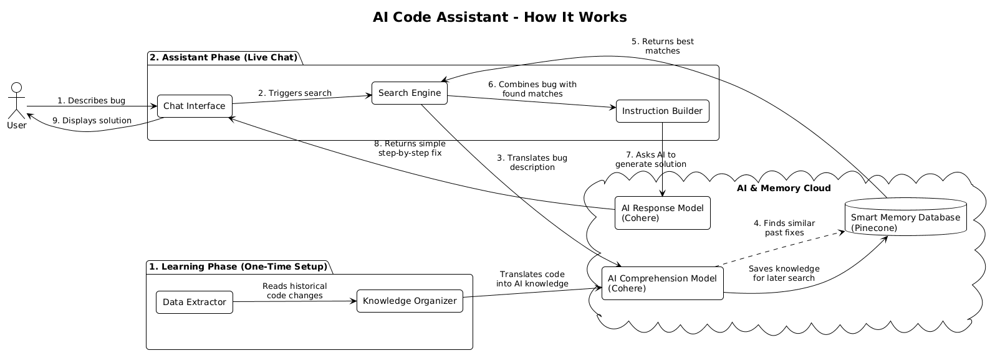

# RepoRAG


## Project Purpose
RepoRAG is an automated Code Assistant that utilizes Retrieval-Augmented Generation (RAG) to diagnose software defects and formulate step-by-step resolution strategies based on repository history. 

The system operates through an end-to-end extraction and inference pipeline:
1. **Offline Pipeline**: Iterates through historical Git commits via `src/extractor.py`, extracting raw source code diffs and metadata metrics (lines added/deleted). The dataset is then vectorized in `src/ingest.py` using Cohere's embedding models and upserted into a Pinecone Serverless vector database.
2. **Online Inference**: When a bug description is submitted via the `src/main.py` CLI, `src/search.py` embeds the query and retrieves the top-K relevant historical fixes from Pinecone. The `src/prompt_engine.py` module structures a strict context window, preventing hallucinations by commanding the Cohere LLM to output a consolidated, generalized fix based exclusively on proven historical patches.

## Architecture Diagram


## Tech Stack
- **Language**: Python 3.11
- **Version Control Interface**: GitPython
- **Vector Database**: Pinecone
- **Embeddings**: Cohere (`embed-english-v3.0`)
- **Large Language Model**: Cohere (`command-r-plus-08-2024`)

## Setup Instructions

### 1. Initialize Virtual Environment
Run the following commands to isolate your project dependencies:
```powershell
python -m venv myvenv
.\myvenv\Scripts\activate
```

### 2. Install Dependencies
Install the required framework packages:
```powershell
pip install gitpython pinecone-client cohere python-dotenv
```

### 3. Environment Variables
Create a `.env` file in the root directory and configure the required API keys:
```env
GITHUB_TOKEN=your_github_token_here
PINECONE_API_KEY=your_pinecone_api_key_here
COHERE_API_KEY=your_cohere_api_key_here
```

## Usage

Start the interactive CLI wrapper to query the RAG pipeline natively:
```powershell
python src\main.py
```

**Example Execution:**
```text
Enter a bug description (or type 'exit' to quit): color issues

[1/4] Searching database for related historical commits...
Generating embeddings for query: 'color issues'...
Executing semantic search against Pinecone Index...
[2/4] Retrieved 2 relevant commits. Formatting context...
[3/4] Generating structured RAG prompt...
[4/4] Querying LLM for fix recommendation...

==================================================
  AI FIX RECOMMENDATION
==================================================
1) The Issue
The application has color-related inconsistencies due to scattered hardcoded values across the login, signup, and home screens.

2) The Reasons
The problem stems from inconsistencies in color usage and a lack of centralized color management in the widget tree.

3) The Solutions
Create a central `constants.dart` file defining an `AppColors` class. Migrate `main.dart` and all individual UI components (e.g., Drawer, AppBar, TextFields) to reference these centralized tokens instead of raw hex codes. Ensure the new color scheme is strictly applied.
==================================================
```
